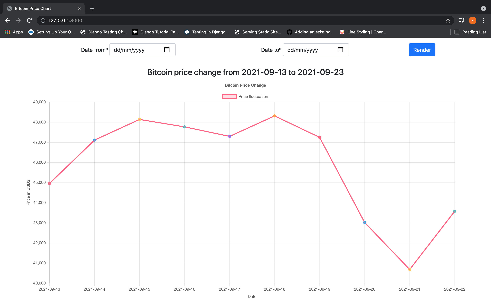

# CONSUMING COINDESK'S API FOR BITCOIN PRICE CHANGE DATA

## Tools Used
Django, Javascript and ChartJs

## Code Usage
- Clone the repository
- Create your environment 
 ```shell
       python3 -m venv env
 ```
 - Activate your environment 
 ```shell
       source env/bin/activate
 ```
 - Install all requirements
 ```shell
       pip install -r requirements.txt
 ```
 - Make migrations
```shell
       python3 manage.py makemigrations
 ```
 - Migrate changes
```shell
       python3 manage.py migrate
 ```
 - Run the following command to run the code in development mode
```shell
       python3 manage.py runserver
 ```
## Preview
Below is a screenshot of the data rendered in a line chart
<br>
 


